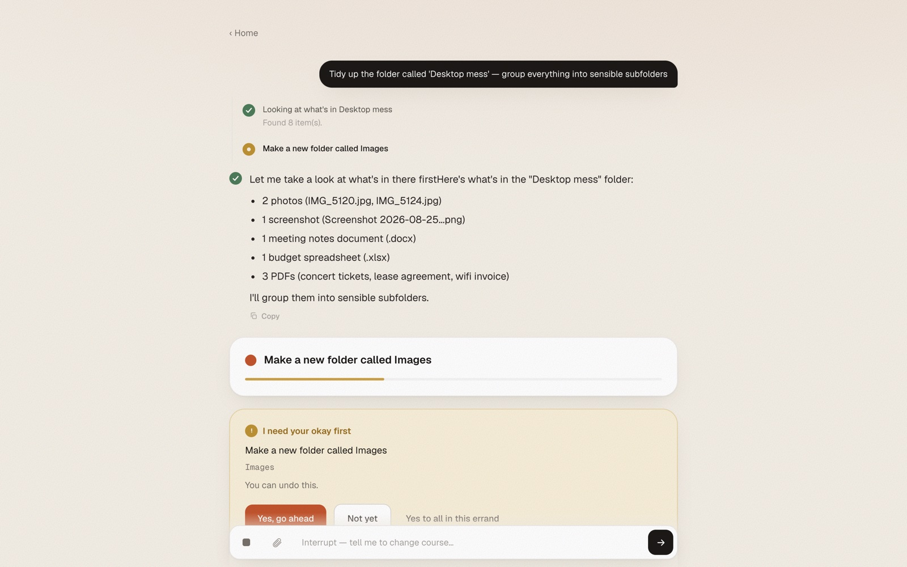
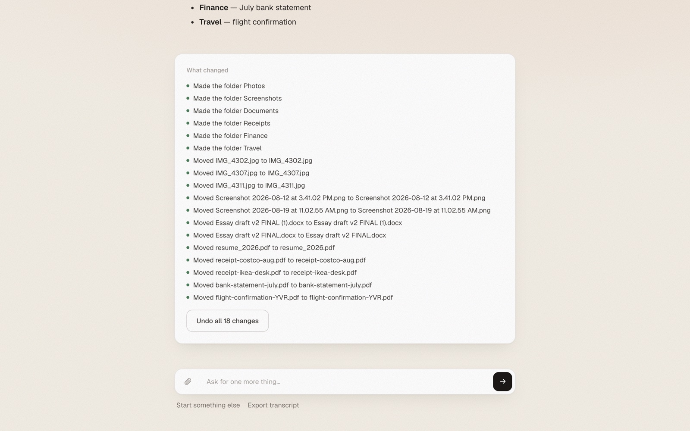

<p align="center">
  
</p>

# Errand

A calm AI agent for people who have never heard of agents.

Errand does real work on your computer: tidies folders, reads and explains documents, researches
the web, drives your actual Chrome. Before it changes anything it asks you in plain language, and
one Undo puts things back the way they were.

Built from scratch to own every line. No LangChain, no agent SDK, no framework code. The OpenAI SDK
is transport only (pointed at OpenRouter or a local Ollama); the loop, tools, sessions, streaming,
memory, and durability are hand-written TypeScript.


## What using it looks like

You type what you want done. Errand plans, works, and stops before anything touches your files.
The question is plain English and nothing happens until you choose.



When it finishes you get a receipt of every change and an Undo that works, because reversibility
is structural: deletes go to a Review folder, overwrites snapshot the prior bytes first.



## What it can do

- **Files** — organize, rename, move, copy, delete inside one sandboxed folder you pick. Every
  change is reversible and gated behind your okay.
- **Documents** — reads PDF, Word, Excel, CSV, and pulls text out of images with OCR. The docx and
  xlsx parsers are hand-rolled (zip + inflate + XML).
- **Web** — keyless DuckDuckGo search plus page reading.
- **Your real browser** — a Chrome extension works inside your logged-in sessions (Gmail included)
  with no OAuth. Risky clicks pause for your okay; benign ones don't nag you.
- **Memory + dreaming** — remembers durable facts about you (embedding-retrieved into the prompt)
  and, if you turn dreaming on, consolidates what it learned and suggests ideas.
- **Skills + MCP** — teach it named, reusable procedures; plug in MCP tool servers from Settings.
- **Desktop app** — ships as a macOS Electron app (`npm run dist`). The API key lives encrypted in
  your keychain and never reaches the renderer.

## Quick start

```bash
npm install
cp .env.example .env      # add your OPENROUTER_API_KEY
npm run web               # → http://localhost:3200
```

`npm run app` runs the desktop build instead. For browser tasks, load the unpacked extension:
`chrome://extensions` → Load unpacked → `extension/`.

Any tool-capable OpenRouter model works (pick one in Settings → Model), or point it at a local
Ollama.

## How it's built

The agent core is UI-agnostic. The loop emits one typed `AgentEvent` stream through an injected
sink; a CLI sink and a web/SSE sink both consume it, which keeps the core honest. Tools are a typed
registry of self-describing, gated, reversible operations assembled into capability packs
(`src/capabilities/`), so adding a domain is one pack file.

Three design commitments carry the whole thing:

1. **Reversible by construction.** An operation journal records the inverse of every mutation at
   record time. Undo is a data structure, not a feature.
2. **Approval is a pause, not an error.** The loop parks on a Promise mid-turn. Denials resolve
   cleanly, so the model conversation never 400s.
3. **Crash-proof runs.** Every turn checkpoints to SQLite at tool boundaries. `kill -9` the app
   mid-approval and the next launch resumes the exact turn, re-parks the approval, and never
   re-runs an irreversible tool. A chaos harness crash-injects at every boundary to prove it
   (`npm run chaos:test`).

Storage is SQLite via Node's built-in `node:sqlite`, zero native dependencies. Next.js 14 App
Router hosts the server side; the API key never reaches the browser.

## Tests

Thirty offline suites cover the loop, the approval gate, journal/undo, file ops, the document
parsers, sandbox-escape defenses, the SSE sink, migrations, and the crash-resume matrix:

```bash
npx tsc --noEmit
npm run loop:test      # agent loop: tool selection, multi-turn
npm run chaos:test     # crash-inject at every checkpoint, resume, verify
npm run fileops:test   # file tools + Undo + symlink-escape defenses
```

The full list is in `package.json` (`*:test`). Three more (`mem`, `doc`, `ocr`) need an API key or
are slow.

## Docs

- **[PLAN.md](PLAN.md)** — the living spec and full dated changelog
- **[HANDOFF.md](HANDOFF.md)** — current state, gotchas, where to pick up
